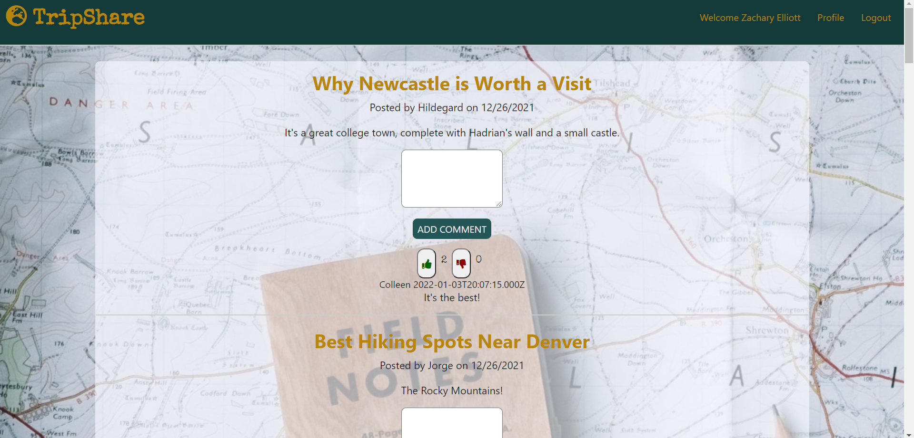

# TripShare

## Description

A Travel Blog, using Node, Express, Sequelize, Cloudinary, MySQL, and deployed on Heroku.



**Tools & Skills Used**<br>
Node.js, Express.js, Sequelize, Cloudinary, MySQL and Heroku.

## User Story

```
AS A user
I WANT to be able to create a blog account 
SO THAT I can share and interact with other travel enthusiasts
```

## Acceptance Criteria

```
GIVEN a travel blog
WHEN I open the travel blog
THEN I am presented with a landing page with posts
WHEN I click on the login button
THEN I am presented with a page where I can login or signup for the ability to post or comment on the site
WHEN I submit a new blog with a picture, title, and content
THEN this post appears on the homepage blog page and in my profile page with previous posts
WHEN I click on the title of post on the homepage
THEN I can edit the entry
WHEN I click on the delete button in my profile
THEN the entire post is deleted
WHEN I click on the like or dislike button
THEN my response is saved for other users to see
WHEN I add a comment 
THEN this is saved for other users to see
```

## Table of Contents

- [Installation](#installation)
- [Usage](#usage)
- [Credits](#credits)
- [License](#license)
- [Contributing](#contributing)
- [Links](#links)
- [Questions](#questions)

## Installation

No installation necessary. This application can be run from the browser using the live link in the "Links" section.

## Usage

Please see below for examples of this application's usage.

### Video of Usage:

- https://watch.screencastify.com/v/b87PhEIT79rJz3dTIazt 

## Credits

- https://devcenter.heroku.com/articles/getting-started-with-nodejs?singlepage=true#deploy-the-app
- https://www.section.io/engineering-education/a-raw-nodejs-rest-api-without-frameworks-such-as-express/
- https://www.tabnine.com/code/javascript/functions/express/Router/delete
- https://expressjs.com/en/guide/routing.html
- https://www.youtube.com/watch?v=K9jTQPb0Xso&ab_channel=BrettM
- https://www.youtube.com/watch?v=aZ16pkrMkZE&ab_channel=TraversyMedia
- https://www.youtube.com/watch?v=pKd0Rpw7O48&t=3153s&ab_channel=ProgrammingwithMosh
- https://coding-boot-camp.github.io/full-stack/github/professional-readme-guide

## License

[](https://opensource.org/licenses/MIT)<br/>

    MIT License

    Copyright (c) 2021 COLLEEN FIMISTER, JACKSON BARKER, RYAN MCCULLOCH, ZACHARY ELLIOTT

    Permission is hereby granted, free of charge, to any person obtaining a copy
    of this software and associated documentation files (the "Software"), to deal
    in the Software without restriction, including without limitation the rights
    to use, copy, modify, merge, publish, distribute, sublicense, and/or sell
    copies of the Software, and to permit persons to whom the Software is
    furnished to do so, subject to the following conditions:

    The above copyright notice and this permission notice shall be included in all
    copies or substantial portions of the Software.

    THE SOFTWARE IS PROVIDED "AS IS", WITHOUT WARRANTY OF ANY KIND, EXPRESS OR
    IMPLIED, INCLUDING BUT NOT LIMITED TO THE WARRANTIES OF MERCHANTABILITY,
    FITNESS FOR A PARTICULAR PURPOSE AND NONINFRINGEMENT. IN NO EVENT SHALL THE
    AUTHORS OR COPYRIGHT HOLDERS BE LIABLE FOR ANY CLAIM, DAMAGES OR OTHER
    LIABILITY, WHETHER IN AN ACTION OF CONTRACT, TORT OR OTHERWISE, ARISING FROM,
    OUT OF OR IN CONNECTION WITH THE SOFTWARE OR THE USE OR OTHER DEALINGS IN THE
    SOFTWARE.

## Contributing

No contributions needed at this time, but please feel free to contact me at my email address below if you would like to contact me about this project.


## Links

[Heroku Live Link](https://blooming-ridge-32748.herokuapp.com/)

[GitHub Link](https://github.com/carlincb/TripShare)

## Questions

If you have questions, please contact us at carlin.colleen@gmail.com or find us at https://github.com/carlincb.